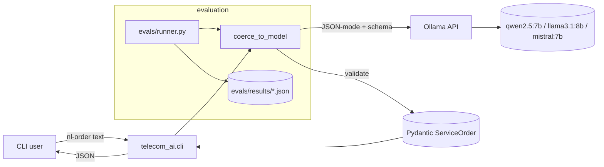

# M1 Architecture

## Components

| Component | Purpose | File |
|---|---|---|
| `cli` | Typer entry point `nl-order` | `src/telecom_ai/cli.py` |
| `OllamaClient` | Async HTTP wrapper around Ollama `/api/chat` with JSON-mode | `src/telecom_ai/llm/ollama_client.py` |
| `coerce_to_model` | Reask loop that forces output into a Pydantic model | `src/telecom_ai/llm/structured.py` |
| `ServiceOrder` | TMF641-flavored schema | `src/telecom_ai/schemas/service_order.py` |
| `order_intake` prompt | System prompt + few-shot examples | `src/telecom_ai/prompts/order_intake.py` |
| `evals/runner` | Scores schema-validity, field-accuracy, latency | `evals/runner.py` |

## Out of M1
- No retrieval / RAG (added in M2)
- No tool calls (M3)
- No multi-step workflow (M4)
- No NETCONF (M5)
- No multi-agent (M6)
- No tracing UI (M7)
