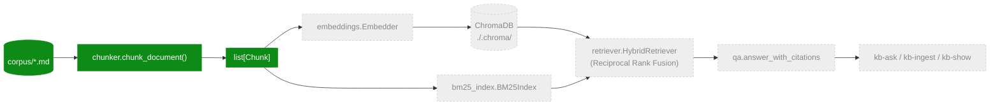

# M2 Architecture — Knowledge Base: RAG over Provisioning Specs

> **Status:** in progress, tracks [issue #2](https://github.com/spereir2/telecom-ai-agent-framework/issues/2).
> This file is updated incrementally as each task lands, rather than written once at
> the end (unlike `architecture-m1.md`). The pipeline diagram below marks each
> component `done` or `pending` so it stays accurate mid-milestone.

## Task status

| # | Task | Status |
|---|---|---|
| 1 | Corpus & licensing (`corpus/`) | ✅ done |
| 2 | Dependencies + `rag/` package scaffolding | ✅ done |
| 3 | Markdown chunker (`chunker.py`) | ✅ done |
| 4 | Embeddings + Chroma store | ⬜ pending |
| 5 | BM25 index | ⬜ pending |
| 6 | Hybrid retriever (RRF) | ⬜ pending |
| 7 | QA chain (citations) | ⬜ pending |
| 8 | CLI (`kb-ingest` / `kb-ask` / `kb-show`) | ⬜ pending |
| 9 | Eval dataset (`qa_v1.jsonl`) | ⬜ pending |
| 10 | Eval runner | ⬜ pending |
| 11 | Docs + README + tag `v0.2.0-m2` | 🔶 this file, in progress |

## Pipeline



## Components

| Component | Purpose | File | Status |
|---|---|---|---|
| `Chunk` | Dataclass: `id`, `text`, `source`, `headings`, `index` | `src/telecom_ai/rag/chunker.py` | ✅ |
| `chunk_document` | Splits one markdown file into overlapping, heading-tagged chunks | `src/telecom_ai/rag/chunker.py` | ✅ |
| `Embedder` | Batched `sentence-transformers/all-MiniLM-L6-v2` wrapper | `src/telecom_ai/rag/embeddings.py` | ⬜ |
| `Store` | ChromaDB persistent collection wrapper | `src/telecom_ai/rag/store.py` | ⬜ |
| `BM25Index` | Lexical index over the same chunks | `src/telecom_ai/rag/bm25_index.py` | ⬜ |
| `HybridRetriever` | BM25 + dense fusion via RRF | `src/telecom_ai/rag/retriever.py` | ⬜ |
| `qa` | Answer-with-citations prompt assembly | `src/telecom_ai/rag/qa.py` | ⬜ |
| `kb-ingest` / `kb-ask` / `kb-show` | CLI entry points | `src/telecom_ai/rag/cli.py` | ⬜ |

---

## Task 3 deep dive — the markdown chunker

### What it does

`chunk_document(path, corpus_root, max_tokens=512, overlap_tokens=64)` turns one
markdown file into a list of `Chunk` objects — the unit that gets embedded, indexed,
and eventually cited back to the user as `[filename#chunk-N]`. Each `Chunk` carries:

- `id` — deterministic, e.g. `tmf/tmf641-service-ordering.md#2` (`<rel_path>#<index>`)
- `text` — the chunk's raw markdown text
- `source` — the file's path relative to `corpus/`
- `headings` — the heading hierarchy active where the chunk starts, e.g.
  `["TMF641 Service Ordering Management API — Excerpts", "Resource: ServiceOrderItem"]`
- `index` — 0-based position within the file

### Algorithm

The implementation is two passes over the file, both O(n) in the number of lines:

**Pass 1 — `_lines_with_headings`.** Walk the file line by line, maintaining a stack
of `(level, title)` for the headings seen so far (a plain list used as a stack).
On every `#`…`######` line, pop any stack entries at the same or a deeper level,
then push the new heading — this is standard "pop siblings and descendants"
heading-tree bookkeeping, e.g.:

```
# Title            stack: [(1, Title)]
## Section A       stack: [(1, Title), (2, Section A)]
### Sub A1         stack: [(1, Title), (2, Section A), (3, Sub A1)]
## Section B       pops Sub A1 (level 3 ≥ 2) and Section A (level 2 ≥ 2)
                   stack: [(1, Title), (2, Section B)]
```

Every line — heading or body — is paired with a snapshot of the titles currently
on the stack, giving a `list[(line, headings)]` for the whole document.

**Pass 2 — greedy packing.** Walk that list, accumulating lines into a `buffer`
and a running word count (`_token_count` — see caveat below). When the next line
would push the buffer over `max_tokens`, the buffer is flushed as a `Chunk`
(`headings` = the heading stack of the buffer's *first* line), and the next
buffer is seeded with `_overlap_tail`: the longest trailing run of lines from the
flushed buffer whose word count fits within `overlap_tokens`. This is what gives
consecutive chunks their overlap — the same words that ended chunk *i* open
chunk *i+1*, so retrieval doesn't lose context at a chunk boundary.

A buffer is always allowed to accept at least one line even if that line alone
exceeds `max_tokens` (the overflow check only fires when the buffer is
non-empty) — so one oversized line (e.g. a huge table row) becomes its own
over-budget chunk instead of an infinite loop or a crash.

### Design decisions / tradeoffs

- **Token count is whitespace word-splitting, not a real tokenizer.** `corpus/README.md`
  already caveats its token estimates as "approximate (GPT-2 tokeniser)"; this
  chunker doesn't pull in a BPE tokenizer (would mean depending on `tiktoken` or
  loading a `transformers` tokenizer just to count words) and instead treats
  `len(line.split())` as the token count. Good enough for chunk-sizing on this
  corpus; not a faithful token count for cost/latency estimation elsewhere.
- **Line-based packing, not word-flattening.** An alternative design flattens the
  whole document into one word list and slides a fixed-size window across it.
  That's simpler but destroys markdown structure (tables, list items) mid-line.
  Packing whole lines keeps paragraphs and table rows intact in `chunk.text`,
  at the cost of chunks not landing on an exact word count.
- **Blank lines cost 0 tokens.** They pass the overlap-budget check for free,
  which mostly just preserves paragraph breaks (`\n\n`) across chunk boundaries
  — harmless, and chunk text is `.strip("\n")`-trimmed before being stored, so
  leading/trailing blank lines don't leak into the final `chunk.text`.

### Known limitation

`headings` is taken from the *first line in the buffer*, which — because of the
overlap mechanism — is sometimes a blank line carried over from the previous
chunk, snapshotted *before* a new heading on the next line was pushed onto the
stack. Concretely: the chunk whose text opens with `## Section B` can report
`headings == ["Title", "Section A"]` (the parent context at the moment the
carried-over blank line was captured) rather than `["Title", "Section B"]`. The
heading text itself is still correct and present in `chunk.text` — it's only the
`headings` *metadata* that can lag by one section on chunks that open exactly on
a heading line. Not fixed as part of task 3 since it doesn't affect the chunks
that matter for citation accuracy (body-text chunks correctly reflect their
enclosing section — verified in `test_heading_hierarchy_tracked`); worth
revisiting if `kb-ask` citations ever look off by one section.

### Tests (`tests/test_chunker.py`)

| Test | Verifies |
|---|---|
| `test_tiny_doc_single_chunk` | A doc under `max_tokens` produces exactly one chunk, correct id/index/headings |
| `test_no_headings_doc` | Multi-chunk split with no headings anywhere → `headings == []` throughout |
| `test_heading_hierarchy_tracked` | Push/pop stack behavior, including sibling sections correctly popping a deeper nested heading (`Sub A1` dropped when `Section B` starts) |
| `test_deterministic_ids_and_overlap` | Sequential `#0..#8` ids and exact word-level overlap between consecutive chunks, hand-verified against the packing algorithm |
| `test_oversized_single_line_does_not_crash` | A single line far exceeding `max_tokens` (a 51-token heading) still produces a valid chunk instead of crashing |
| `test_empty_document_yields_no_chunks` | Whitespace-only file → `[]` |
| `test_invalid_token_budgets_raise` | `max_tokens <= 0`, `overlap_tokens >= max_tokens`, and `overlap_tokens < 0` all raise `ValueError` |

### Verification performed

- `pytest tests/test_chunker.py` — 7/7 pass; full suite (`--ignore=tests/test_ollama_client.py`) 13/13 pass
- `ruff check .` — clean
- `mypy src/telecom_ai/rag/chunker.py tests/test_chunker.py` — clean
  (repo-wide `mypy` still fails on `structured.py`'s PEP 695 generic syntax under
  the local Python 3.11 `.venv` — pre-existing, unrelated to this task, confirmed
  via `git stash`)
- Ran `chunk_document` against every real file in `corpus/`: chunk counts range
  3–5 per file at the default 512/64 token budget, headings nest correctly
  (e.g. `TMF641 Service Ordering… → Resource: ServiceOrderItem`)
